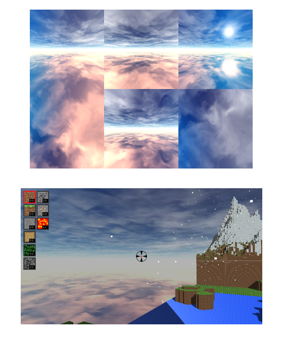

# MiniMineCraft
Final Project of Computer Graphics, developed by ***Jiawei Wang, Kaixiang Miao, YiGuo***.

CGGT, Upenn
## Screenshot

## Description
`C++` `OpenGL4.0` `Qt Creator`

Besides the basic features of the MiniMineCraft, we also implemented Biomes, Skybox, Weather system, Shadow mapping, Day and night cycle, Fire and GUI. 
## Results
### Biomes

### Skybox

### Weather system
* Geometry Shader
  *  Calculate the local axis of the point
  *  Expand the point sprite to a billboard

### Shadow Mapping
* Directional Light
* Optimization
  * A **bias** to solve the shadow acne
  * **Cull Front Face** for shadow depth rendering to solve peter panning 
  * **PCF** to make the shadow more smooth

### Day and night Cycle
* Not only the light intense will change, also the direction

### Fire and GUI
* The fire will spread along the grass

